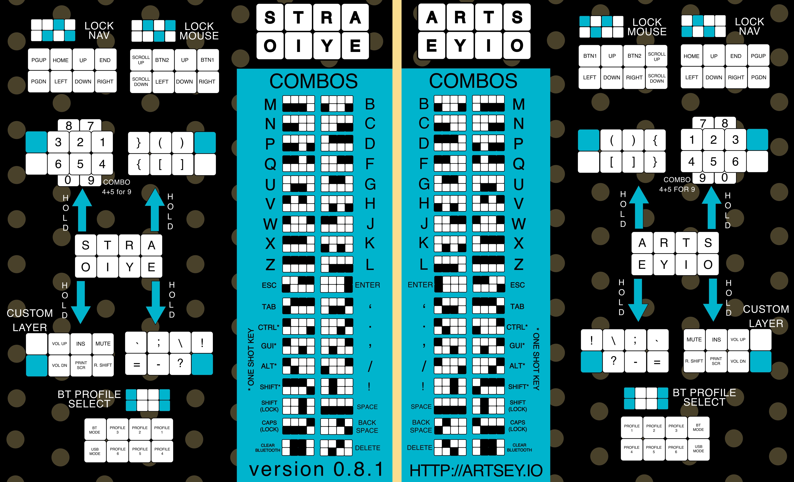

# ARTSEY Simulator

This is a website to simulate having an ARTSEY Keyboard.

Check https://artsey.io/ for more info on the topic.

## ARTSEY

ARTSEY is a one-handed keyboard, filled with key combos to write all the letters and characters.

## Combos

This are the combos implemented in the real version of ARTSEY.

In this simulator there's only **SOME** of the **right-hand** layout.

## RuleGen

To create the rules, you have a small python program designed for that. 

To use it, run `$ python rulegen.py`, then write down a combination and it's associated actual output.

To stop the execution, just type 'END' instead of a combination, and enter a few times. The rules code will be printed on screen for you to copy and paste into the code.

**E.G.**
> $ klñ  
> $ m  
> $ jlñ  
> $ p  
> $ END  
> $  
> $ rules.set( '00000111', 'm' );  
> $ rules.set( '00001011', 'p' );

## TODO

- [x] Main Page
- [x] Basic Keyboard Detection
- [x] Basic Combos
- [ ] 'Special' Combos _(escape, shift...)_
- [ ] Hold Combos
- [ ] Custom Keyboard Layout

## Contributing

All contributions are welcome. Simply fork the repo, make the changes you feel and open a Pull Request.

The codebase is just plain HTML, CSS and JS, so should be simple to give it a look for everyone. 

